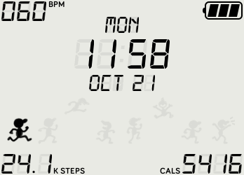
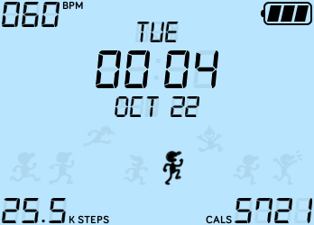

# Fit & Bit  

##### Version 1.0  

Fit & Bit is a clock face for the Fitbit Ionic smart watch. Its retro LCD look, 
inspired by Nintendo's Game And Watch portable games, keeps an emphasis on stats 
offered at a glance. It also features a little athlete running with you, wherever 
you might be headed!  

It's also open source (because I know how much that can help beginners)!  

### Features
📅 Day of the week and date  
🔋 Battery level bar divided into thirds  
❤ Heart rate in BPM that updates every 5 seconds  
🏃🏽‍♀️🔥 Steps and calories stats featured clearly  
🎨 Customizable background color with 6 presets!  

### Screenshots
| Example 1 | Example 2 |
| --------- | --------- |
|  |  |  

### Coming (very) soon
☁ Background elements like clouds, trees, and a hurdle track for the runner  
⚡ Heart rate coupled with symbol showing heart rate zone (resting, fat burn, cardio/peak)  
☝🏽 Option to allow users to select the two stats featured  
💡 Night mode for black background with white runner silhouette  

⌚ Check out my other clock faces (available for download in the Fitbit App Gallery!): [Maritime](https://github.com/ishfulthinking/fitbit-maritime) and [Rays](https://github.com/ishfulthinking/fitbit-rays)

🙋🏽‍♂️ If you enjoy this app, please consider helping a broke college student (me)! https://www.buymeacoffee.com/ishfulthinking
